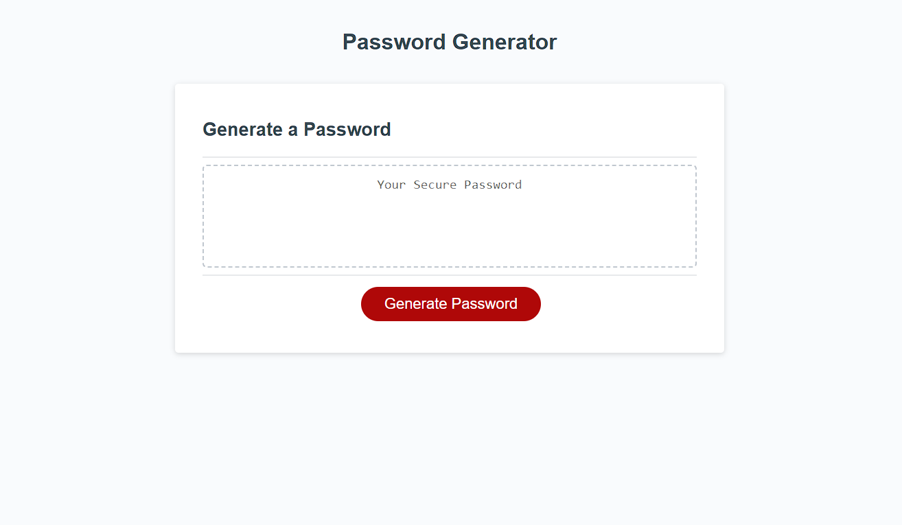

# My-Password-Generator
 

## Description
This password generator uses a combination of user inputs to form randomized passwords to protect user information and accounts.

## Usage

Upon opening the page the site will prompt users to input infromation they require for their password such as:
- Character lenth (8-128)
- Capital and Undercase letters
- Numeric Integers
- Special characters
The site will then create a randomly generated password for maximum security.

## Credits

N/A

## License

Please refer to the LICENSE in the repo.

## Links

Github: https://github.com/Anthonykahly/My-Password-Generator
Pages:  https://anthonykahly.github.io/My-Password-Generator/
